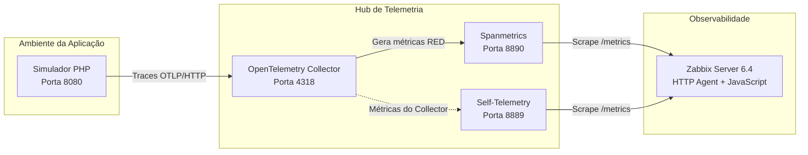

# 🔭 Observabilidade Descomplicada com PHP, OpenTelemetry e Zabbix

> Laboratório prático de observabilidade utilizando **PHP + OpenTelemetry + OpenTelemetry Collector + Zabbix 6.4**, com geração de métricas RED a partir de traces.

**Duração:** 2 horas
**Instrutor:** Felipe
**Nível:** Intermediário / Avançado

---

## 📋 Sobre o projeto

Este repositório contém o material prático do laboratório **"Observabilidade Descomplicada com PHP, OpenTelemetry e Zabbix"**.

O objetivo é demonstrar como instrumentar uma aplicação PHP simples/legada para gerar **traces via OTLP/HTTP**, enviar esses dados para o **OpenTelemetry Collector** e utilizar o connector **Spanmetrics** para transformar os traces em métricas de observabilidade.

Essas métricas são posteriormente coletadas pelo **Zabbix 6.4**, utilizando **HTTP Agent + JavaScript + pré-processamento**, permitindo acompanhar indicadores no modelo **RED**:

* **Rate** — taxa de requisições;
* **Errors** — taxa de erros;
* **Duration** — duração/latência das requisições.

A proposta é centralizar a inteligência de telemetria no OpenTelemetry Collector, evitando a necessidade de implementar uma instrumentação complexa diretamente na aplicação.

---

## 🎯 Objetivos do laboratório

Ao final do laboratório, você será capaz de:

* Entender os conceitos básicos do OpenTelemetry;
* Trabalhar com o protocolo **OTLP via HTTP**;
* Instrumentar uma aplicação PHP para geração de traces;
* Implantar o OpenTelemetry Collector utilizando Docker;
* Utilizar o connector `spanmetrics`;
* Transformar traces em métricas RED;
* Expor métricas no formato Prometheus;
* Configurar o Zabbix 6.4 para consumir métricas via HTTP Agent;
* Utilizar JavaScript no pré-processamento do Zabbix;
* Calcular throughput, taxa de erros e latência média;
* Executar o laboratório em uma VM do Google Cloud Platform.

---

## 📚 Conteúdo programático

1. Conceitos de OpenTelemetry
2. OTLP via HTTP
3. Instrumentação de aplicações PHP
4. Simulador de pagamentos
5. OpenTelemetry Collector
6. Connector `spanmetrics`
7. Métricas no formato Prometheus
8. Zabbix HTTP Agent
9. Pré-processamento com JavaScript
10. Métricas RED
11. Geração de tráfego
12. Laboratório prático na GCP

---

## 🏗️ Arquitetura

O fluxo de dados do laboratório segue a seguinte arquitetura:



### 🔄 Fluxo de dados

```text
┌─────────────────┐
│   Aplicação PHP │
│  Simulador      │
└────────┬────────┘
         │
         │ OTLP/HTTP
         ▼
┌──────────────────────────┐
│ OpenTelemetry Collector  │
│ :4318                    │
└────────┬─────────────────┘
         │
         │ spanmetrics
         ▼
┌──────────────────────────┐
│ Métricas Prometheus      │
│ :8890                    │
└────────┬─────────────────┘
         │
         │ HTTP Agent
         ▼
┌──────────────────────────┐
│ Zabbix 6.4               │
│ HTTP Agent + JavaScript  │
└──────────────────────────┘
```

---

# 🛠️ Laboratório Prático

## 1. Pré-requisitos

Antes de iniciar, certifique-se de possuir:

* Uma VM Linux no Google Cloud;
* Docker instalado;
* Acesso SSH à VM;
* Google Cloud CLI (`gcloud`);
* Zabbix Server 6.4;
* Aplicação PHP do laboratório;
* Template `template_observability.json`.

### Portas utilizadas

|  Porta | Serviço                 | Finalidade              |
| -----: | ----------------------- | ----------------------- |
| `8080` | Aplicação PHP           | Simulador de pagamentos |
| `4318` | OpenTelemetry Collector | Recepção OTLP/HTTP      |
| `8889` | OpenTelemetry Collector | Self-Telemetry          |
| `8890` | Spanmetrics             | Métricas Prometheus     |

---

# ☁️ 2. Configuração do Firewall na GCP

Acesse o **Cloud Shell** do Google Cloud e crie uma regra de firewall permitindo as portas utilizadas pelo laboratório:

```bash
gcloud compute firewall-rules create allow-otel-observability \
  --direction=INGRESS \
  --priority=1000 \
  --network=default \
  --action=ALLOW \
  --rules=tcp:4318,tcp:8889,tcp:8890,tcp:8080 \
  --source-ranges=0.0.0.0/0
```

> ⚠️ **Atenção:** esta regra libera as portas para qualquer origem (`0.0.0.0/0`), o que é adequado apenas para um laboratório controlado. Em um ambiente de produção, restrinja as origens e exponha somente as portas realmente necessárias.

### 🔐 Acesso à VM

Após configurar o firewall, conecte-se via SSH à VM utilizada no laboratório.

Exemplo:

```bash
gcloud compute ssh srv-observabilidade-stack
```

> 💡 Os próximos comandos devem ser executados **dentro da VM**, e não diretamente no Cloud Shell.

---

# 📡 3. Implantação do OpenTelemetry Collector

O OpenTelemetry Collector será responsável por:

1. Receber traces da aplicação PHP;
2. Processar os spans;
3. Enviá-los para o connector `spanmetrics`;
4. Gerar métricas RED;
5. Expor as métricas no formato Prometheus.

## 3.1 Criar a configuração

Na VM, execute:

```bash
cat << 'EOF' > /tmp/otel-config.yaml
receivers:
  otlp:
    protocols:
      http:
        endpoint: 0.0.0.0:4318

connectors:
  spanmetrics:
    histogram:
      explicit:
        buckets: [5ms, 10ms, 25ms, 50ms, 100ms, 250ms, 500ms, 1s, 2.5s, 5s]
    metrics_flush_interval: 15s

processors:
  batch:

exporters:
  debug:
    verbosity: basic

  prometheus:
    endpoint: 0.0.0.0:8890
    namespace: app

service:
  telemetry:
    metrics:
      level: detailed
      address: 0.0.0.0:8889

  pipelines:
    traces:
      receivers: [otlp]
      processors: [batch]
      exporters: [debug, spanmetrics]

    metrics:
      receivers: [otlp, spanmetrics]
      processors: [batch]
      exporters: [prometheus]
EOF
```

---

## 3.2 Executar o Collector

Remova uma instância anterior, caso exista:

```bash
sudo docker rm -f otel-collector 2>/dev/null || true
```

Agora execute o container:

```bash
sudo docker run -d \
  --name otel-collector \
  --restart unless-stopped \
  -p 4318:4318 \
  -p 8889:8889 \
  -p 8890:8890 \
  -v /tmp/otel-config.yaml:/etc/otelcol-contrib/config.yaml \
  otel/opentelemetry-collector-contrib:0.107.0
```

Verifique se o container está em execução:

```bash
sudo docker ps
```

E acompanhe os logs:

```bash
sudo docker logs otel-collector -f
```

---

# 🐘 4. Deploy da aplicação PHP

A aplicação utilizada no laboratório simula um sistema de pagamentos.

Ela recebe requisições HTTP e gera traces que serão enviados ao OpenTelemetry Collector.

## 4.1 Acessar o projeto

Entre no diretório do código-fonte:

```bash
cd ~/caminho-do-seu-projeto-php
```

## 4.2 Construir a imagem Docker

```bash
sudo docker build -t payments-app-local .
```

## 4.3 Executar a aplicação

Remova uma instância anterior:

```bash
sudo docker rm -f simulador-telemetria 2>/dev/null || true
```

Execute o container:

```bash
sudo docker run -d \
  --name simulador-telemetria \
  --restart unless-stopped \
  -p 8080:80 \
  -e OTEL_EXPORTER_OTLP_ENDPOINT="http://10.128.0.2:4318" \
  payments-app-local
```

> ⚠️ Substitua `10.128.0.2` pelo endereço IP correto do OpenTelemetry Collector na sua VM/rede.

Verifique o container:

```bash
sudo docker ps
```

---

# 🚦 5. Geração de tráfego

Para que o Zabbix consiga calcular corretamente as métricas, precisamos gerar tráfego contínuo na aplicação.

O teste abaixo alterna entre:

* pagamento com sucesso: `valor=100`;
* pagamento com erro de negócio: `valor=-1`.

Isso produz aproximadamente **50% de requisições com erro**.

Execute:

```bash
while true; do
  curl -s -X POST \
    http://localhost:8080/processa_pagamento.php \
    -d "conta_origem=1101&conta_destino=2002-9&valor=100" \
    > /dev/null

  curl -s -X POST \
    http://localhost:8080/processa_pagamento.php \
    -d "conta_origem=1101&conta_destino=2002-9&valor=-1" \
    > /dev/null

  sleep 0.5
done
```

---

## 🔎 5.1 Validar os traces

Em outro terminal, acompanhe os logs do Collector:

```bash
sudo docker logs otel-collector -f
```

Você deverá observar os spans recebidos pela aplicação.

---

# 📊 6. Validando as métricas

O `spanmetrics` transforma os spans recebidos em métricas.

O endpoint Prometheus pode ser consultado diretamente:

```bash
curl http://localhost:8890/metrics
```

Para visualizar apenas algumas métricas da aplicação:

```bash
curl -s http://localhost:8890/metrics | grep app_
```

O Collector também disponibiliza sua própria telemetria:

```bash
curl http://localhost:8889/metrics
```

---

# 📈 7. Configuração do Zabbix 6.4

O Zabbix utilizará o **HTTP Agent** para consultar os endpoints de métricas expostos pelo OpenTelemetry Collector.

## 7.1 Importar o template

Na interface web do Zabbix:

```text
Data collection
    └── Templates
        └── Import
```

Selecione:

```text
template_observability.json
```

Durante a importação, habilite:

* ✅ Update existing
* ✅ Create new

---

## 7.2 Associar o template

Associe o template:

```text
Template OTel Collector via HTTP Agent
```

ao host correspondente à VM onde o laboratório está executando.

---

# 🔬 8. Validando os dados no Zabbix

Acesse:

```text
Monitoring
    └── Latest data
```

Localize os itens relacionados ao OpenTelemetry.

Para acelerar a validação, utilize:

```text
Execute now
```

com intervalo de coleta de aproximadamente:

```text
10 segundos
```

---

# 🧮 9. Como as métricas são processadas

## 🚀 Throughput

O throughput representa a quantidade de requisições processadas por segundo.

O Zabbix utiliza o contador:

```text
app_calls_total
```

e aplica o pré-processamento:

```text
Prometheus Pattern
        ↓
Change per second
```

Conceitualmente:

```text
Throughput = Δapp_calls_total / Δtempo
```

---

## ❌ Taxa de erro

A taxa de erro é obtida a partir das métricas produzidas pelo `spanmetrics`.

O processamento utiliza JavaScript para:

1. Identificar as requisições com status de erro;
2. Identificar o total de requisições;
3. Calcular a proporção de erros.

Conceitualmente:

```text
Error Rate = Requisições com erro / Total de requisições
```

Por exemplo:

```text
50 erros
---------
100 requisições

= 50%
```

---

## ⏱️ Latência média

O `spanmetrics` disponibiliza métricas de soma e quantidade de observações.

No laboratório, a latência média é calculada utilizando:

```text
app_duration_milliseconds_sum
```

dividido por:

```text
app_duration_milliseconds_count
```

Fórmula:

```text
Latência Média =
app_duration_milliseconds_sum
/
app_duration_milliseconds_count
```

O resultado representa a duração média das requisições observadas.

---

# 💡 Dica importante: Change per second

Itens que utilizam o pré-processamento:

```text
Change per second
```

precisam de **duas coletas válidas e sequenciais** para calcular a taxa.

Por exemplo:

```text
Coleta 1 → 100 requisições
Coleta 2 → 110 requisições
```

O Zabbix consegue calcular:

```text
110 - 100 = 10 novas requisições
```

e, considerando o intervalo de coleta, determinar o valor em **req/s**.

Por isso, durante a validação do laboratório, mantenha o gerador de tráfego executando:

```bash
while true; do
    ...
done
```

Caso o tráfego pare, o throughput poderá aparecer como `0 req/s` ou ficar temporariamente sem valor, dependendo do comportamento do item e do histórico disponível.

---

# 🧩 Componentes utilizados

| Componente                  | Função                                 |
| --------------------------- | -------------------------------------- |
| **PHP**                     | Aplicação simuladora de pagamentos     |
| **Docker**                  | Containerização                        |
| **OpenTelemetry**           | Instrumentação e geração de telemetria |
| **OTLP/HTTP**               | Transporte dos traces                  |
| **OpenTelemetry Collector** | Recepção e processamento da telemetria |
| **Spanmetrics**             | Conversão de spans em métricas         |
| **Prometheus format**       | Exposição das métricas                 |
| **Zabbix 6.4**              | Coleta, processamento e monitoramento  |
| **GCP**                     | Infraestrutura do laboratório          |

---

# 🧠 Conceito RED

O laboratório utiliza o modelo **RED**, uma abordagem bastante utilizada para monitoramento de serviços.

### Rate

Quantas requisições o serviço está processando?

```text
req/s
```

### Errors

Quantas requisições estão falhando?

```text
%
```

### Duration

Quanto tempo as requisições estão levando?

```text
ms
```

Juntos, esses três indicadores fornecem uma visão rápida da saúde e do comportamento de um serviço.

---

# 🗺️ Visão geral do laboratório

```text
                  ┌───────────────────┐
                  │    PHP App        │
                  │ Payment Simulator │
                  └─────────┬─────────┘
                            │
                       OTLP / HTTP
                            │
                            ▼
              ┌─────────────────────────┐
              │ OpenTelemetry Collector │
              │                         │
              │       :4318             │
              └────────────┬────────────┘
                           │
                    Spanmetrics
                           │
                           ▼
              ┌─────────────────────────┐
              │ Prometheus Metrics      │
              │                         │
              │       :8890             │
              └────────────┬────────────┘
                           │
                       HTTP Agent
                           │
                           ▼
              ┌─────────────────────────┐
              │       Zabbix 6.4        │
              │                         │
              │ HTTP Agent              │
              │ JavaScript              │
              │ Preprocessing           │
              └─────────────────────────┘
```

---

# 🧪 Checklist de validação

Use este checklist para verificar se o laboratório está funcionando:

* [ ] VM criada na GCP
* [ ] Firewall configurado
* [ ] Docker funcionando
* [ ] OpenTelemetry Collector executando
* [ ] Porta `4318` recebendo OTLP
* [ ] Aplicação PHP executando na porta `8080`
* [ ] Traces sendo enviados para o Collector
* [ ] `spanmetrics` gerando métricas
* [ ] Endpoint `/metrics` disponível na porta `8890`
* [ ] Self-Telemetry disponível na porta `8889`
* [ ] Template importado no Zabbix
* [ ] Template associado ao host
* [ ] HTTP Agent coletando os dados
* [ ] Throughput calculado
* [ ] Taxa de erro calculada
* [ ] Latência média calculada

---

# ⚠️ Observações

Este projeto foi desenvolvido com finalidade **educacional e de laboratório**.

Algumas configurações, como:

```text
--source-ranges=0.0.0.0/0
```

não são recomendadas para ambientes de produção.

Para um ambiente real, considere:

* Restringir regras de firewall;
* Utilizar redes privadas;
* Implementar TLS;
* Autenticar os endpoints;
* Controlar exposição das métricas;
* Utilizar secrets adequadamente;
* Definir limites de recursos para os containers;
* Monitorar o próprio OpenTelemetry Collector;
* Avaliar retenção e cardinalidade das métricas.

---

# 🚀 Próximos passos

Depois de concluir o laboratório, alguns possíveis exercícios são:

* Adicionar dashboards no Zabbix;
* Criar triggers para aumento da taxa de erro;
* Criar alertas para aumento da latência;
* Monitorar disponibilidade do Collector;
* Adicionar mais serviços à arquitetura;
* Comparar métricas RED com métricas de infraestrutura;
* Adicionar traces distribuídos entre múltiplas aplicações;
* Utilizar TLS no OTLP;
* Experimentar outros exporters do OpenTelemetry Collector.

---

## 👨‍🏫 Laboratório

**Observabilidade Descomplicada com PHP, OpenTelemetry e Zabbix**

**Instrutor:** Felipe
**Duração:** 02:00h
**Nível:** Intermediário / Avançado

---

⭐ Se este laboratório foi útil para você, considere deixar uma estrela no repositório!
